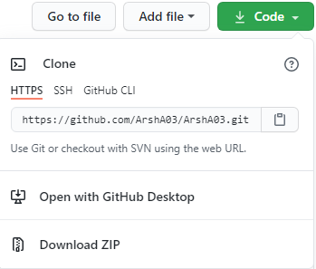

# Installation

The only way to use this module is by cloning it from its [github repository](https://github.com/ArshA03/Wave-Module). If you have previous knowledge of [cloning a repository](https://docs.github.com/en/github/creating-cloning-and-archiving-repositories/cloning-a-repository) you can skip this part.

## Cloning Github Repo

Open the command line and head to the folder you want your project to be placed in:

```powershell
>>> cd "Your project folder"
```

Then enter the following command:

(This would download all the files in the repository in your local project folder.)

```python
>>> git clone https://github.com/ArshA03/Wave_Module.git
```

You can also **directly** download the repository from the GitHub by downloading the ZIP file as shown below:  

||
|:--:|
|Downloading ZIP file from GitHub|

---

## Importing the module

In order to be able to import the module successfully into your project, you have to put the **Wave_Module.py** file in the same directory as your project; otherwise, you should add the path in which the module exists by `sys`. To do so, add the following line at the top of your script.

```python
sys.path.append(r'THE Full Path To Wave_Module.py')
```

Then import the whole `Wave_Module` by adding the line below:

```python
from Wave_Module import *
```
