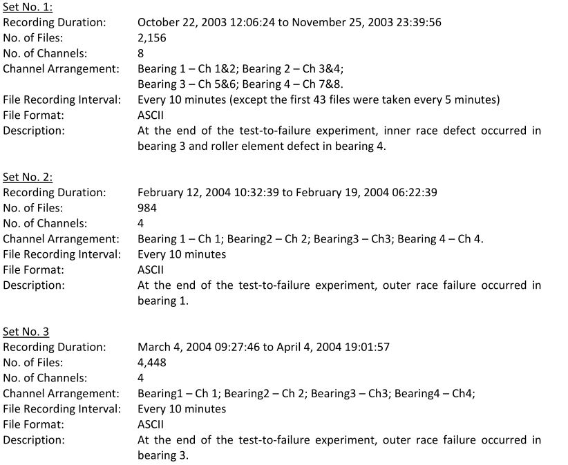
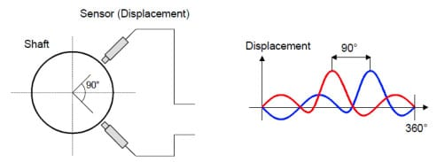
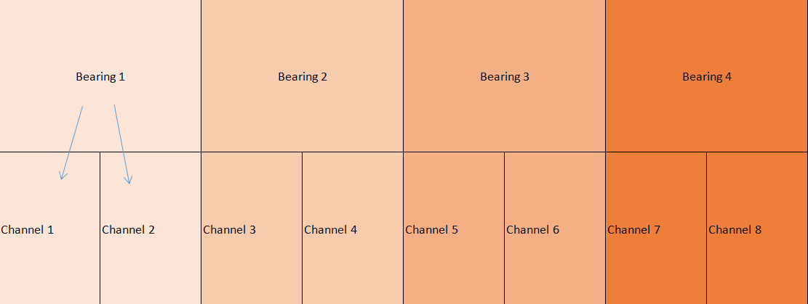

# Get To Know Your Data

This simple module is written for academic purposes in order to help students get a grasp of practical coding. The specified vibration DataSet ([IMS](http://www.imscenter.net/)) mentioned earlier should be downloaded first, and its **document** should be read carefully.

---

## IMS Vibration DataSet

After downloading the dataset, there will be three test folders, each containing files carrying vibration data. The differences between these tests and their files are fully explained in the original document.

**Below is a screenshot of the document inside the IMS data set**:

||
|:--:|
|ScreenShot of the IMS Document|

There are **3** sets of tests, and the number of files and the channels included are specified for each set. Also, the kind of failure at the end of each set is written in the description part.

>The format of files carrying data in ASCII. ASCII is a character encoding standard or a numerical representation of a character.

---

### Channels

Channels are used to separate different routes of data acquisition. For instance, a two-channel bearing vibration data represents two different vibration signals for a single bearing <mark>often</mark> acquired with two probes perpendicular to each other!

||
|:--:|
|Sensor Positioning|

As you can see, there are four bearings tested in this data set. According to the documentation, there are 8 channels in <mark>Set 1</mark> (Two channels for each of the 4 bearings) and 4 channels in both <mark>Set 2 & 3</mark> (One channel for each of the 4 bearings).

>These channels are separated by columns in the data files, and therefore a file with eight channels of vibration data consists of 8 columns of data points.

||
|:--:|
|Channels & Bearings In Set 1|

||
|:--:|
|Channels & Bearings In Set 2&3|

---

### Dates

You should consider that dates help make a time series or forecast the data and help you specify healthy data from the unhealthy! For example, the data acquired on the first day of testing represents the healthy vibration data without any problem in the bearings. On the contrary, the last vibration data file in each set represents bearings with severe failure.
